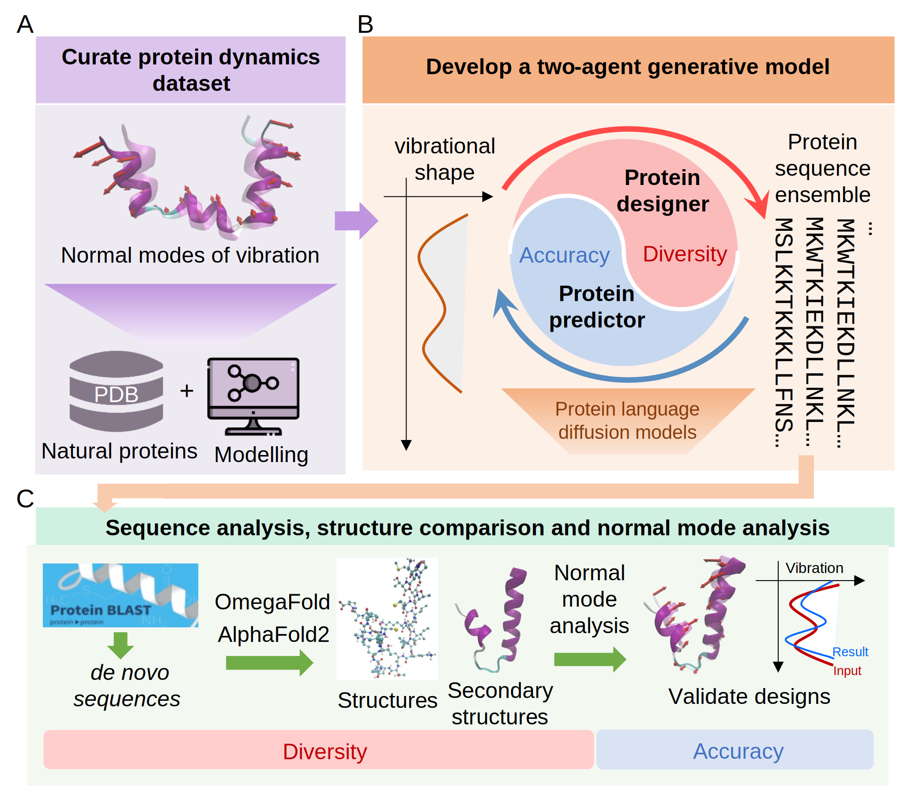

# VibeGen: End-to-end de novo protein generation targeting normal mode vibrations using a language diffusion model duo

Bo Ni<sup>1,2</sup>, Markus J. Buehler<sup>1,3,4*</sup>

<sup>1</sup> Laboratory for Atomistic and Molecular Mechanics (LAMM), Massachusetts Institute of Technology

<sup>2</sup> Department of Materials Science and Engineering, Carnegie Mellon University

<sup>3</sup> Center for Computational Science and Engineering, Schwarzman College of Computing, Massachusetts Institute of Technology

<sup>4</sup>Lead contact

*Correspondence: mbuehler@MIT.EDU

Rarely being static, natural proteins often rely on dynamic motions to achieve key biological functions, such as enzymatic activity, signal transduction and structural regulation. However, it remains challenging to grasp the direct link between sequences and dynamics of natural proteins or design proteins beyond nature based on their dynamical signature. Here, we report a generative duo of protein language diffusion models that generate proteins to meet the specified normal mode of vibration as design goals. Consisting of a protein designer and a predictor, our duo designs ensemble of various protein sequences based on the given normal mode and predicts their vibrations to select the accurate ones, aiming at both diversity and accuracy. Via full-atom molecular simulations for direct validation, we demonstrate the generated proteins are mostly de novo and fulfill the targeted vibrational mode across the residues of the backbone. Our models provide end-to-end connections between protein sequences and vibrational motions in both directions, offer efficient pathways to navigate the broad protein sequence space unconstrained by biological synthesis, and enable the discovery of flexible proteins with desired dynamic properties and biological functions.



## Installation

Create a virtual environment

```bash
conda create --prefix=./VibeGen_env 
conda activate ./VibeGen_env

```

Install:
```bash
pip install git+https://github.com/lamm-mit/ModeShapeDiffusionDesign.git

```
If you want to create an editable installation, clone the repository using `git`:
```bash
git clone https://github.com/lamm-mit/ModeShapeDiffusionDesign.git
cd ModeShapeDiffusionDesign
```
Then, install:
```bash
pip install -r requirements.txt
pip install -e .
```

### Directory structure
```
ModeShapeDiffusionDesign/
│
├── VibeGen/                                    # Source code directory
│   ├── DataSetPack.py
│   ├── ModelPack.py
│   ├── TrainerPack.py
│   ├── UtilityPack.py
│   ├── JointSamplingPack.py
│   └── ...
│
├── demo_1_Inferrence_with_trained_duo.ipynb    # demo 1: make an inference
│
├── colab_demo/                                 # demos for colab
│   ├── Inference_demo.ipynb                    # demo 1: make an inference
│   └── ...
│
├── setup.py                                    # The setup file for packaging
├── requirements.txt                            # List of dependencies
├── README.md                                   # Documentation
├── assets/                                     # Support materials
└── ...
```

## Usage

### Inference notebooks
In the following example, for each input normal mode shape condition, we use the trained ProteinDesigner to propose 20 candidates. Then the trained ProteinPredictor will pick the best and worst two from them based on its predition. The chosen seqeucnes then will be folded using OmegaFold and the seondary strucutre of them will be analyzed. 

```
demo_1_inference_with_trained_duo.ipynb
```

Alternatively, similar demo can run using Colab.

[](https://colab.research.google.com/github/lamm-mit/ModeShapeDiffusionDesign/blob/main/colab_demo/Inference_demo.ipynb)

### Pretrained models
The checkpoints of the pretrained model duo is hosted at the [repository](https://huggingface.co/lamm-mit/VibeGen) on Huggingface.

### Reference

```bibtex
@paper{BoBuehler2025VibeGen,
    author = {Ni, Bo and Buehler, Markus J.},
    title = {VibeGen: End-to-end de novo protein generation targeting normal mode vibrations using a language diffusion model duo},
    year = {2025},
    eprint = {XXX.YYYYY},
    archivePrefix = {arXiv},
    doi = {ZZZ},
    url = {ZZZ}
}
```

Our implementation is inspired by the [imagen-pytorch](https://github.com/lucidrains/imagen-pytorch) repository by [Phil Wang](https://github.com/lucidrains).