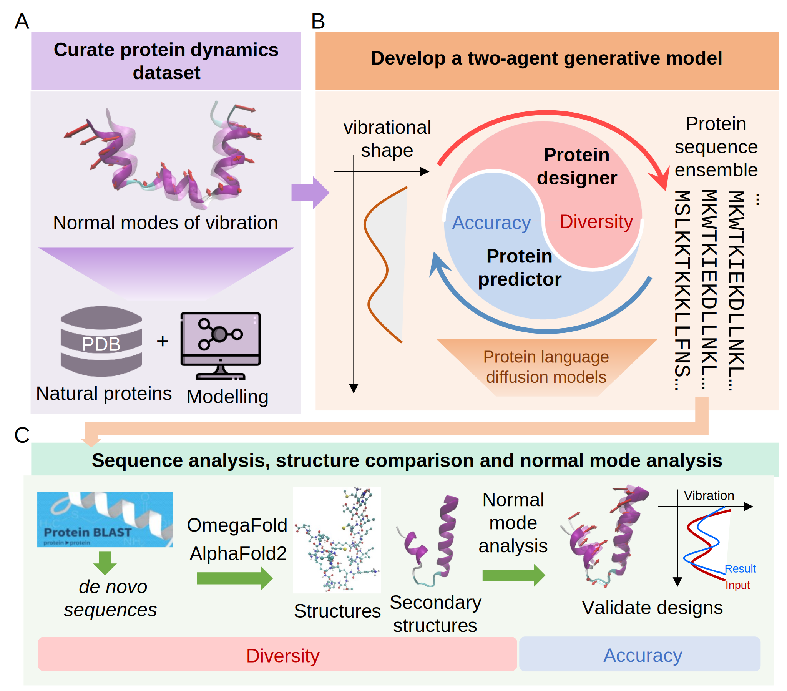

# VibeGen: Agentic End-to-End De Novo Protein Design for Tailored Dynamics Using a Language Diffusion Model 

Bo Ni<sup>1,2</sup>, Markus J. Buehler<sup>1,3,4*</sup>

<sup>1</sup> Laboratory for Atomistic and Molecular Mechanics (LAMM), Massachusetts Institute of Technology

<sup>2</sup> Department of Materials Science and Engineering, Carnegie Mellon University

<sup>3</sup> Center for Computational Science and Engineering, Schwarzman College of Computing, Massachusetts Institute of Technology

<sup>4</sup> Lead contact

<sup>*</sup> Correspondence: mbuehler@MIT.EDU

Proteins are dynamic molecular machines whose biological functions, spanning enzymatic catalysis, signal transduction, and structural adaptation, are intrinsically linked to their motions. We introduce VibeGen, a generative AI model based on an agentic dual-model architecture, comprising a protein designer that generates sequence candidates based on specified vibrational modes and a protein predictor that evaluates their dynamic accuracy. Via direct validation using full-atom molecular simulations, we demonstrate that the designed proteins accurately reproduce the prescribed normal mode amplitudes across the backbone while adopting various stable, functionally relevant structures. Generated sequences are de novo, exhibiting no significant similarity to natural proteins, thereby expanding the accessible protein space beyond evolutionary constraints. Our model establishes a direct, bidirectional link between sequence and vibrational behavior, unlocking new pathways for engineering biomolecules with tailored dynamical and functional properties. Our model holds broad implications for the rational design of enzymes, dynamic scaffolds, and biomaterials via dynamics-informed protein engineering.



## Installation

Create a virtual environment

```bash
conda create --prefix=./VibeGen_env 
conda activate ./VibeGen_env

```

Install:
```bash
pip install git+https://github.com/lamm-mit/ModeShapeDiffusionDesign.git

```
If you want to create an editable installation, clone the repository using `git`:
```bash
git clone https://github.com/lamm-mit/ModeShapeDiffusionDesign.git
cd ModeShapeDiffusionDesign
```
Then, install:
```bash
pip install -r requirements.txt
pip install -e .
```

### Directory structure
```
ModeShapeDiffusionDesign/
│
├── VibeGen/                                    # Source code directory
│   ├── DataSetPack.py
│   ├── ModelPack.py
│   ├── TrainerPack.py
│   ├── UtilityPack.py
│   ├── JointSamplingPack.py
│   └── ...
│
├── demo_1_Inferrence_with_trained_duo.ipynb    # demo 1: make an inference
│
├── colab_demo/                                 # demos for colab
│   ├── Inference_demo.ipynb                    # demo 1: make an inference
│   └── ...
│
├── setup.py                                    # The setup file for packaging
├── requirements.txt                            # List of dependencies
├── README.md                                   # Documentation
├── assets/                                     # Support materials
└── ...
```

## Usage

### Inference notebooks
In the following example, for each input normal mode shape condition, we use the trained ProteinDesigner to propose 20 candidates. Then the trained ProteinPredictor will pick the best and worst two from them based on its predition. The chosen seqeucnes then will be folded using OmegaFold and the seondary strucutre of them will be analyzed. 

```
demo_1_inference_with_trained_duo.ipynb
```

Alternatively, similar demo can run using Colab.

[](https://colab.research.google.com/github/lamm-mit/ModeShapeDiffusionDesign/blob/main/colab_demo/Inference_demo.ipynb)

### Pretrained models
The checkpoints of the pretrained models that make up the agentic system is hosted at the [repository](https://huggingface.co/lamm-mit/VibeGen) on Huggingface.

### Sample results


### References

```bibtex
@article{NiBuehler2026VibeGen,
      title = {VibeGen: Agentic end-to-end de novo protein design for tailored dynamics using a language diffusion model},
      author = {Bo Ni and Markus J. Buehler},
      journal = {Matter},
      pages = {102706},
      year = {2026},
      issn = {2590-2385},
      doi = {https://doi.org/10.1016/j.matt.2026.102706},
      url = {https://www.sciencedirect.com/science/article/pii/S259023852600069X},
      keywords = {protein design, protein dynamics, generative AI, agentic collaboration, language diffusion model,  proteins, normal mode},
}

@paper{NiBuehler2025VibeGen,
      title={VibeGen: Agentic End-to-End De Novo Protein Design for Tailored Dynamics Using a Language Diffusion Model}, 
      author={Bo Ni and Markus J. Buehler},
      year={2025},
      eprint={2502.10173},
      archivePrefix={arXiv},
      primaryClass={q-bio.BM},
      url={https://arxiv.org/abs/2502.10173}, 
}
```

Our implementation is inspired by the [imagen-pytorch](https://github.com/lucidrains/imagen-pytorch) repository by [Phil Wang](https://github.com/lucidrains).
